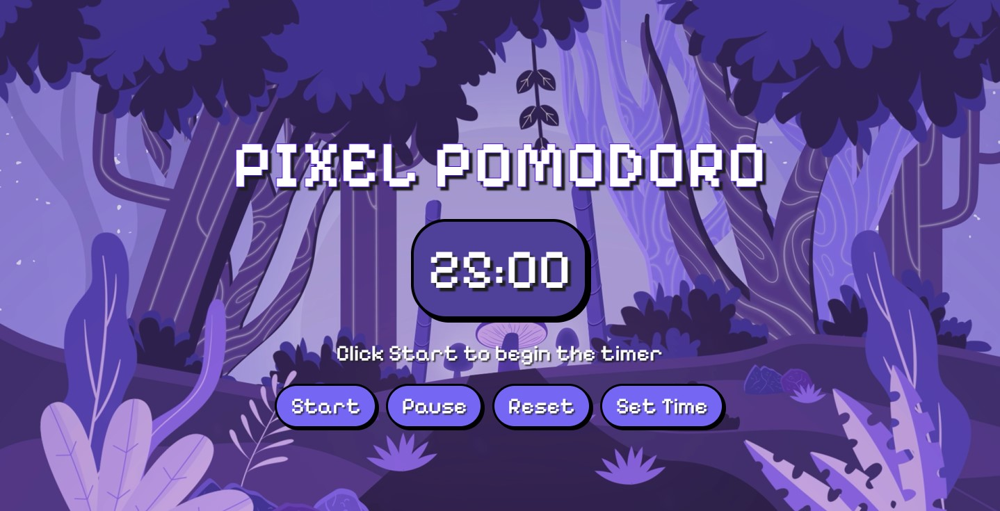

# ⏳ Pixel Pomodoro 

Welcome to **Pixel Pomodoro** – a cute, pixel-art-style **Pomodoro Timer** designed to make productivity fun! 🎮🚀 Stay focused, take breaks, and power through your tasks in style!

## 🌟 Features
- **Pixel Aesthetic** – Retro vibes for a visually pleasing experience 🎨
- **Fully Customizable** – Set your own work and break times ⏰
- **Start, Pause & Reset Controls** – Manage your sessions effortlessly 🕹️
- **Interactive Time Picker** – Adjust minutes and seconds with ease 🔼🔽
- **Background Music** – Stay in the zone with looping audio 🎵
- **Status Messages** – Always know if the timer is running or paused 💬

## 🎮 How to Use
1️⃣ **Set Your Time** – Click the ⏰ button to choose your work session length.  
2️⃣ **Hit Start** – Watch the magic happen as your timer begins! 🚀  
3️⃣ **Pause Anytime** – Need a quick break? Pause your session and resume later!  
4️⃣ **Reset When Needed** – Start fresh with a single click.  

## 🚀 Live Demo
🎯 **Try it out here**: [Pixel Pomodoro Live](https://unrivaled-manatee-5ab30c.netlify.app/)

## 📸 Screenshots


## 🛠️ Installation
Clone the repository and open `index.html` in your browser. Simple! 🖥️
```sh
git clone https://github.com/Muhammad-Murtaazaa/Pixel-Pomodoro.git
cd Pixel-Pomodoro
open index.html
```

## 💡 Why Use a Pomodoro Timer?
The **Pomodoro Technique** is a time management method that improves focus and productivity by breaking work into intervals, usually 25 minutes long, followed by short breaks. Perfect for deep work sessions! 🧠✨

## 📝 Roadmap
🚀 Add cool sound effects 🔊  
🎨 More themes & customization options 🎭  
📅 Integration with to-do lists 📝  

## 🤝 Contributing
Want to improve Pixel Pomodoro? Fork the repo, make your changes, and submit a PR! We’d love to see your ideas. 💡

## 📩 Contact
For any queries or suggestions, feel free to reach out!
🔗 **GitHub**: [Muhammad-Murtaazaa](https://github.com/Muhammad-Murtaazaa)

---
**🎮 Stay productive, stay pixelated! 🚀**
